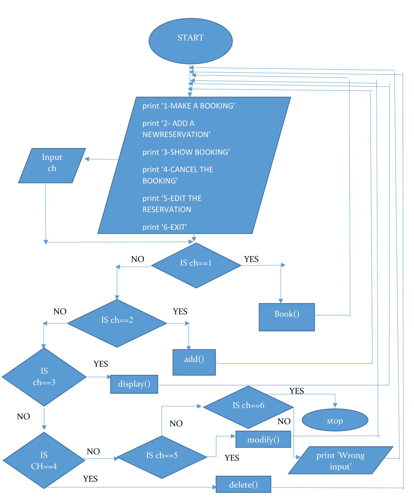
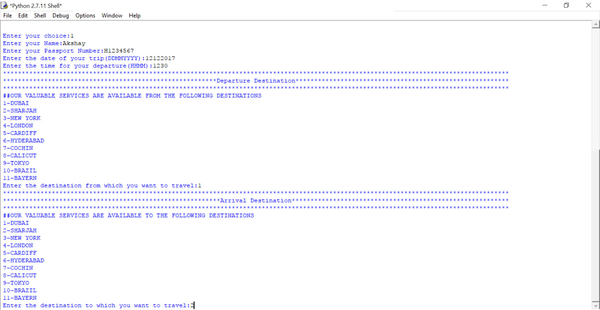
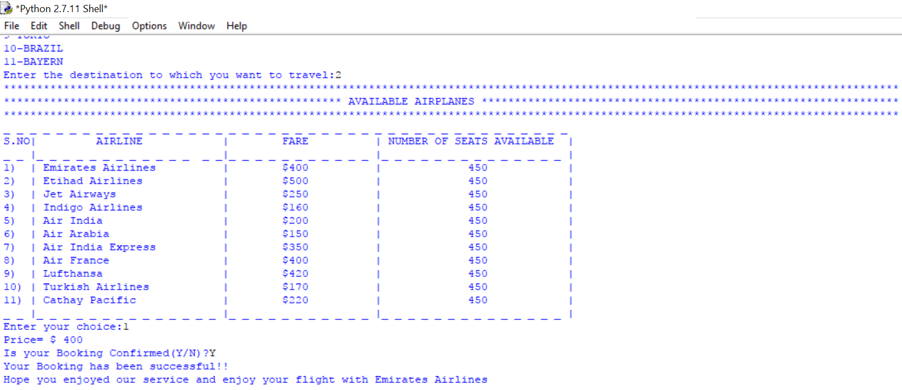
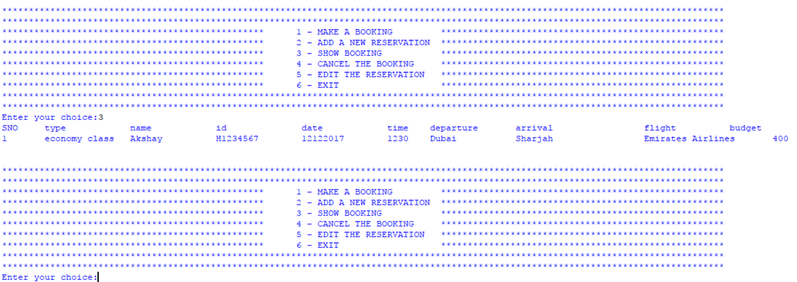
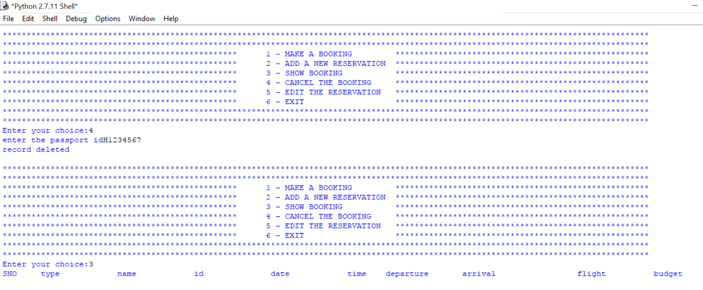

# Airplane Ticket Reservation System
An OOP based python project which replicates an Airplane Ticket Reservation System.

## PROBLEM DEFINITION

This program is designed to help customers perform multiple tasks with the flight booking system. Using the program, the customers can:
  * Create new flight reservations.
  * Display existing flight reservations.
* Edit or delete existing flight reservations.

This program is user-friendly as it allows customers not only to create reservations but also to modify them according to their desire, without any confusion. It eliminates more than 80% of the errors possible while booking a flight. 

## PROJECT DESCRIPTION

In the main menu, there are six options.
1.	MAKE A BOOKING
2.	ADD A NEW RESERVATION
3.	SHOW BOOKING
4.	CANCEL THE BOOKING
5.	EDIT THE RESERVATION
6.	EXIT

* The ‘MAKE A BOOKING’ option allows the user to create a new booking provided that all the necessary information including the customer’s name, passport number, date, time, departure and arrival destinations, and travel class are provided correctly and henceforth, displays a bill.
* The ‘ADD A NEW RESERVATION’ option allows the user to make a new reservation.
*	The ‘SHOW BOOKING’ option displays the details of the booking(s) made in a tabular form.
*	The ‘CANCEL THE BOOKING’ cancels the entire booking made.
* The 'EDIT THE RESERVATION' allows the user to edit an existing reservation.
*	The ‘EXIT’ option allows the user to exit from the booking interface.

## ALGORITHM

1. Start
2. print “1-MAKE A BOOKING”
3. print “2-ADD A NEW RESERVATION”
4. print “3-SHOW BOOKING”
5. print “4-CANCEL THE BOOKING”
6. print "5-EDIT THE RESERVATION"
7. print “6-EXIT”
8. input choice, ch
9. If ch==1 then go to step13 else go to step10
10. If ch==2 then go to step15 else go to step11
11. If ch==3 then go to step17 else go to step12
12. If ch==4 then go to step19 else go to step13
13. If ch==5 then go to step 21 else go to step 14
14. If ch==6 then go to step25 else go to step 23
15. book() 
16. Go to step 2
17. add()
16. Go to step 2
17. display()
18. Go to step2
19. delete()
20. Go to step 2
21. modify()
22. Go to step 2
23. print “wrong input”
24.Go to step 2
25.Stop

## FLOWCHART

## USER-DEFINED FUNCTIONS

|S.NO| FUNCTION NAME|PURPOSE| 
|:---|:---:|:---|
|1.|datetime()|This function is used to receive the customer’s information and enter the customer’s desired time and date of travel.|
|2.|specs()|This function is used to ask the customer for the desired travel class.|
|3.|start()|This function is used to ask the customer for the departure location.|
|4.|arrival()|This function is used to ask the customer for the arrival destination.|
|5.|price()|This function is used to display the price for every available airline as per the chosen flight class and allows the user to select any one package.|
|6.|book()|This function is used to add/save the customers booking details.|
|7.|display()|This function is used to display the customers booking details.|
|8.|add()|This function is used to add further details.|
|9.|check()|This function is used to check if the passport number, date, and time entered are valid or not.|
|10.|modify()|This function is used to edit an existing booking|

## TECHNICAL DOCUMENTATION

This program uses Python 2.7 as a platform for execution.
System Requirements:
 
1.	Windows
 
	*	Windows XP or later. 
	*	Python 2.7.4 or later 
	*	256 MB RAM (768 MB or 1 GB preferred).
	*	3 GHz Pentium 4 processor or similar. 

2.	Mac OS X 

	*	Mac OS X 10.2.x or later 
	*	Python 2.7.4 or later 
	*	256 MB of RAM (1 GB recommended) 
	*	Single 833 MHz G4 system

#### Technical Notes:
Note that the location of the files created and used by the program must be the same as the location of the program.

## USER DOCUMENTATION

To run the program, the user must press F5. The Welcome screen takes you directly to the booking system.

The screen displays a variety of options in which the user is required to choose a desired option. The user is then asked to add all the required details such as the travel class, his/her name, passport number and desired time of travel.

Then, the screen displays the available departure locations and arrival locations. The user is then required to select the desired locations. Next, the screen displays the available airlines and their respective prices and the user is asked to select a package.

The program then asks for booking confirmation. Upon entering ‘Y’, the screen displays the user’s bill, followed by a greeting. Upon entering ‘N’ the user is allowed to edit the details.

## SCREENSHOTS

#### Input

	

	

#### Output

## LIMITATIONS

* This program lacks a graphical user interface. Thereby, making the program less attractive and user-friendly.
* Invalid passport numbers are accepted.
* Older and distant future, when entered (for reservation), are accepted by the program.
* The program is not linked to any airlines or country’s database. Hence, no accuracy of the data entered is ensured.
* The booking information is not displayed in a proper tabular form as the size of the cell depends on the length of the name entered.
* Data stored in the file cannot be easily accessed and requires many lines of code in order to access it.

## SUGGESTIONS FOR IMPROVEMENT

* Use programming languages such as JAVA and SQL to ensure more organized storage and access of data, make the interface more user-friendly and enhance the presentation of the interface.
* Correct the errors in date by providing an error handling code for it, which can be done by cross-checking the date entered with the changing time period.
* By using Database Management Systems, the output can be displayed in a more presentable manner.
* By using Database Management Systems, data can be easily stored and accessed through simple queries.

